# 100 Days of Code Challenge

## Day 29: 27 May 2018

- Started the Pomodoro Clock (*freeCodeCamp*). Can set minutes and seconds, start, stop and reset the timer and can show the time.

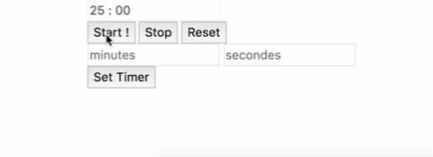

- Read informations about he Pomodoro technique.

- Finished the JavaScript Calculator (*freeCodeCamp*). Added percentage, square, decimal and basics arithmetics operations. Disabled Memory related buttons.

**Aprox Time:** ***2.5 hours***

## Day 28: 26 May 2018

- Started the JavaScript Calculator (*freeCodeCamp*). Added div, buttons, input and text for the calculator, added style for the body and the calculator and added click events (numbers, reset, ON/OFF) and added an indicator that show if the calculator is ON or not.

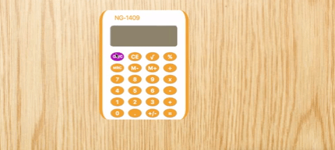

I decided to replicate one of my calculator found recently on my desk 😆

There it is : 

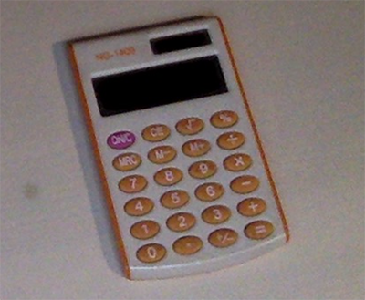

**Aprox Time:** ***2 hours***

## Day 27: 25 May 2018

- Finished the Intermediate Algorithm Scripting (*freeCodeCamp*).

**Aprox Time:** ***1 hour***

## Day 26: 24 May 2018

- Done few algorithms from the Intermediate Algorithm Scripting (*freeCodeCamp*).

- Corrected some issue in previous freeCodeCamp projects, created pen for each project and submited it.

**Aprox Time:** ***2 hours***

## Day 25: 23 May 2018

- Done few algorithms from the Intermediate Algorithm Scripting (*freeCodeCamp*).

- Done the Patatap Clone project (*The Web Developer Bootcamp*).

**Aprox Time:** ***2 hours***

## Day 24: 22 May 2018

- Finished the TODO List project (*The Web Developer Bootcamp*). Added icons, fade transition, added important button and show date.

My solution :

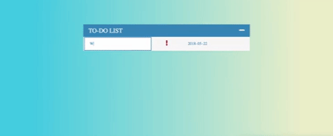

Colt Steele solution : 

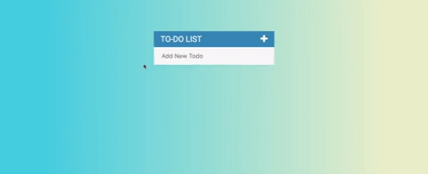

**Aprox Time:** ***3 hours***

## Day 23: 21 May 2018

- Started the TODO List project (*The Web Developer Bootcamp*). Can add, delete and mark as finished To-Do elements.

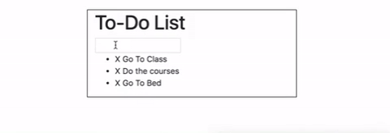

- Done Intro to jQuery and Advanced jQuery (*The Web Developer Bootcamp*).

- Finished the Color Game project (*The Web Developer Bootcamp*). Added score and attempts mechanics, can now switch between modes, added style and refactored some code.

My solution :

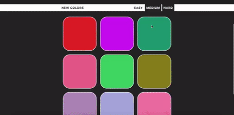

Colt Steele solution : 

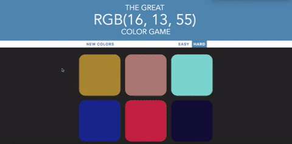

**Aprox Time:** ***4 hours***

## Day 22: 20 May 2018

- Started the Color Game project (*The Web Developer Bootcamp*). Added random color generator, show RGB code to find, can play it (win or lose) and start new game after a win.

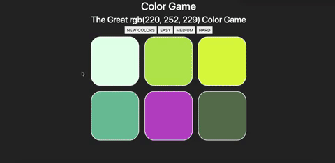

**Aprox Time:** ***2 hours***

## Day 21: 19 May 2018

- Continue the courses from The Web Developer Bootcamp, watched the Color Game project directives.

- Read some chapters about CSS grid from the book : **HTML & CSS** *design and build websites* (JON DUCKETT)

**Aprox Time:** ***1 hour***

## Day 20: 18 May 2018

Time to move on from freeCodeCamp projects for a while :D  

- Done the *DOM Manipulation* and the *Advanced DOM Manipulation* from The Web Developer Bootcamp.

**Aprox Time:** ***1.5 hour***

## Day 19: 17 May 2018

- Finished the Twitch.tv JSON API project (*freeCodeCamp*). Added the ability to search if someone is living, now can show author that are not living and added new fadeIn transition.

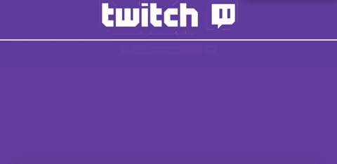

- I reorganized my gitHub repositories (deleted some repositories and added new ones with old projects).

**Aprox Time:** ***2 hours***

## Day 18: 16 May 2018

- Started the Twitch.tv JSON API project (*freeCodeCamp*). Added twitch logo, search bar (from the wikipedia project), added box containing author, title, preview and link for channels in a list.

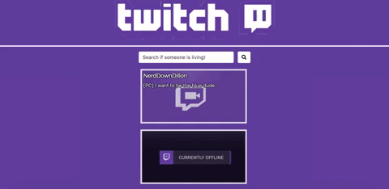

**Aprox Time:** ***1.5 hour***

## Day 17: 15 May 2018

- Read documentation about JSONP method.

- Finished the Wikipedia Viewer project (*freeCodeCamp*). Added Ajax request, animation and style for results.

**Aprox Time:** ***2.5 hours***

## Day 16: 14 May 2018

- Started the Wikipedia Viewer project (*freeCodeCamp*). Added wikipedia logo, search bar and button. Animated placeholder and fadeIn when page is ready.

**Aprox Time:** ***2 hours***

## Day 15: 13 May 2018

- Finished the Local Weather generator(*freeCodeCamp*). Can now show flag country, city, wind speed with estimation given by [Beaufort scale](https://en.wikipedia.org/wiki/Beaufort_scale) 

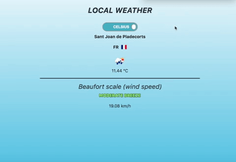

**Aprox Time:** ***1 hour***

## Day 14: 12 May 2018

- Started the Local Weather generator (*freeCodeCamp*). Added bootstrap, added toggle button (HTML5, CSS3) from proto.io, added geolocalisation, show celsius or fahranheit and local weather (Javascript, JQuery).

**Aprox Time:** ***1.5 hour***

## Day 13: 11 May 2018

- Read about DOM Tree from the **JAVASCRIPT & JQUERY** *interactive front-end web development* (JON DUCKETT).

- Drawn a DOM Tree related to the Random Quote Machine (*freeCodeCamp*).

- Finished the Random Quote Machine (*freeCodeCamp*). Added new style.

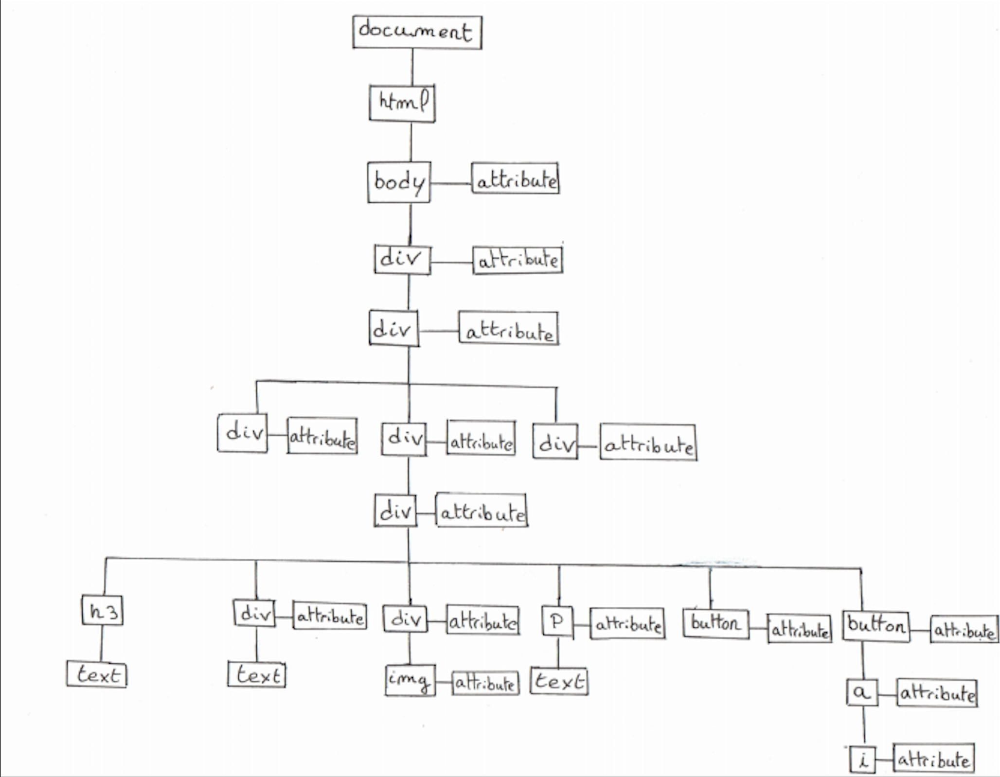

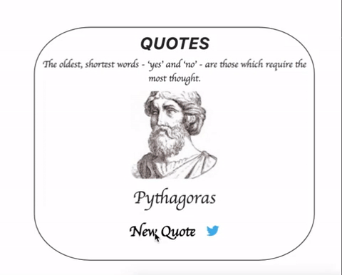  

**Aprox Time:** ***2 hours***

## Day 12: 10 May 2018

- Read about JQuery functions from the **JAVASCRIPT & JQUERY** *interactive front-end web development* (JON DUCKETT).

- Continue the Random Quote Machine (*freeCodeCamp*). Added a button that can tweet the actual quote, avoid div resize, added new margin, padding and radius and added fade transition between quotes.

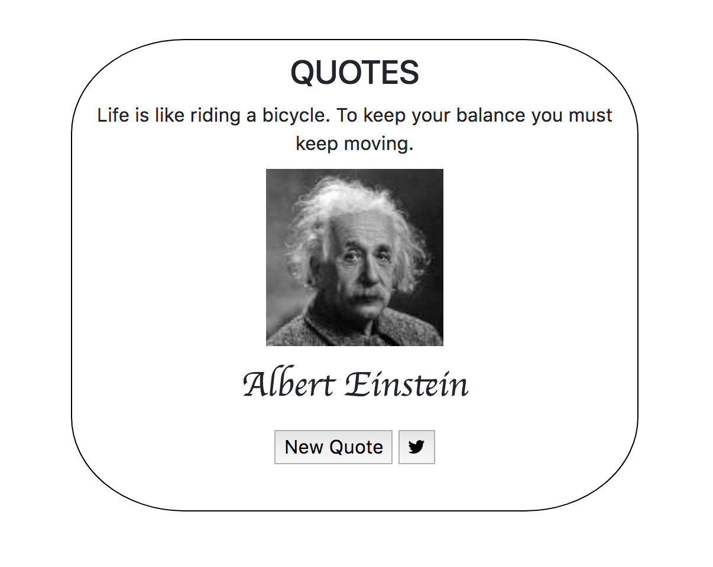  

**Aprox Time:** ***2.5 hours***

## Day 11: 09 May 2018

- Started the Random Quote Machine (HTML, JavaScript and JQuery), defined list of quotes, create function that retrieved a random quote with an image of the author.

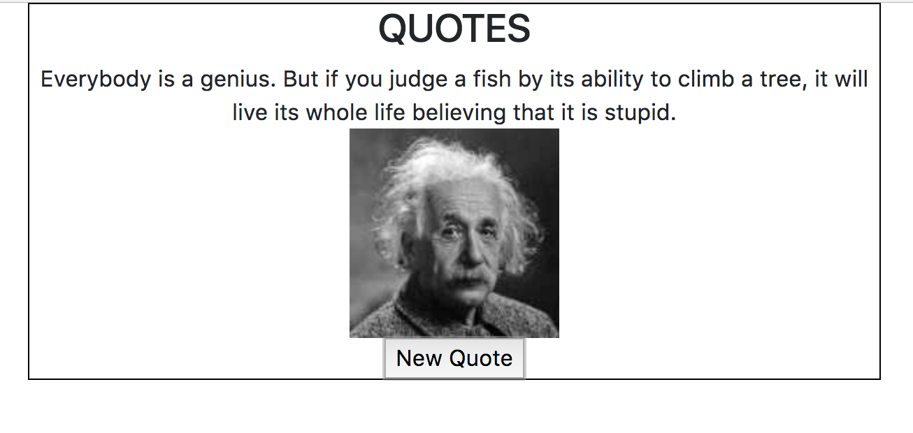  

**Aprox Time:** ***1.5 hour***

## Day 10: 08 May 2018

- Read few articles about web development jobs, tricks and front-end cheatsheets.  

**Aprox Time:** ***1 hour***

## Day 09: 07 May 2018

- Read articles about CSS selectors.  

- Read articles about tricks in CSS. (https://css-tricks.com/).  

**Aprox Time:** ***1 hour***

## Day 08: 06 May 2018

- Completed JSON APIs and Ajax (*freeCodeCamp*)

- Continued the *The Advanced Web Developer Bootcamp* course

**Aprox Time:** ***1 hour***

## Day 07: 05 May 2018

- Completed Basic Algorithm Scripting (*freeCodeCamp*)

**Aprox Time:** ***1.5 hour***  

## Day 06: 04 May 2018

- Completed Basic JavaScript (*freeCodeCamp*)  

- Completed Object Oriented and Functional Programming (*freeCodeCamp*)  

**Aprox Time:** ***2 hours***  

## Day 05: 03 May 2018

- Done coding the Portfolio page for the *freeCodeCamp* (HTML5, CSS3, Bootstrap4, JavaScript, JQuery).

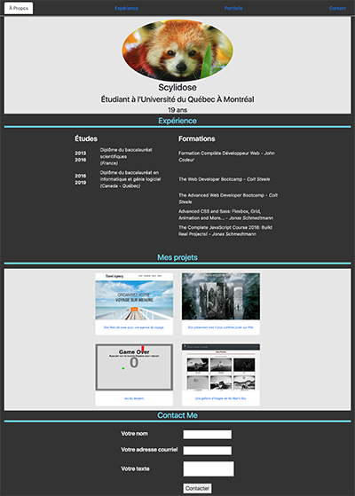  

  

**Aprox Time:** ***2.5 hours***

## Day 04: 02 May 2018

- Finished to code the TributePage (HTML5, CSS3, Bootstrap 4).

Computer :  
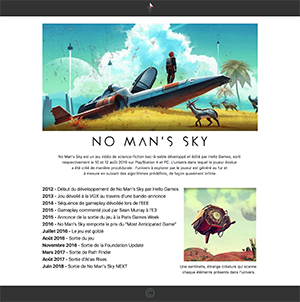  
Tablet :  
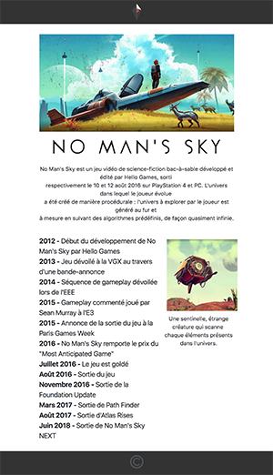  
Phone :   
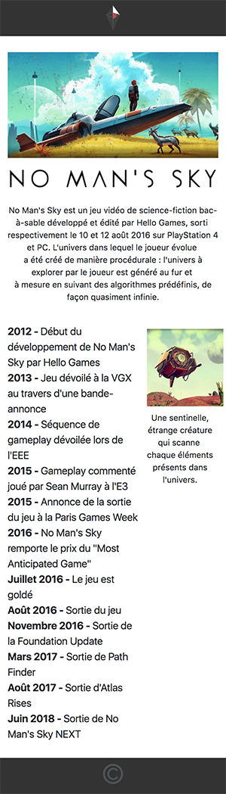  

**Aprox Time:** ***1 hour***

## Day 03: 01 May 2018

- Read how to use CSS grid.

- Continued to code the TributePage, centering and align text and images.

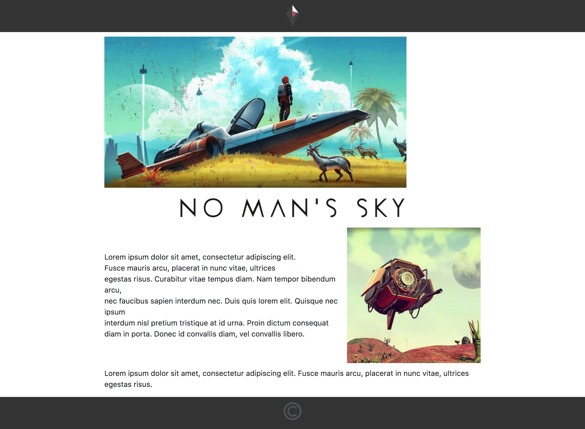

**Aprox Time:** ***1.5 hour***

## Day 02: 30 April 2018

- Learned the basics of wireframes  

- Done 2 differents wireframes for the TributePage (*freeCodeCamp*)  

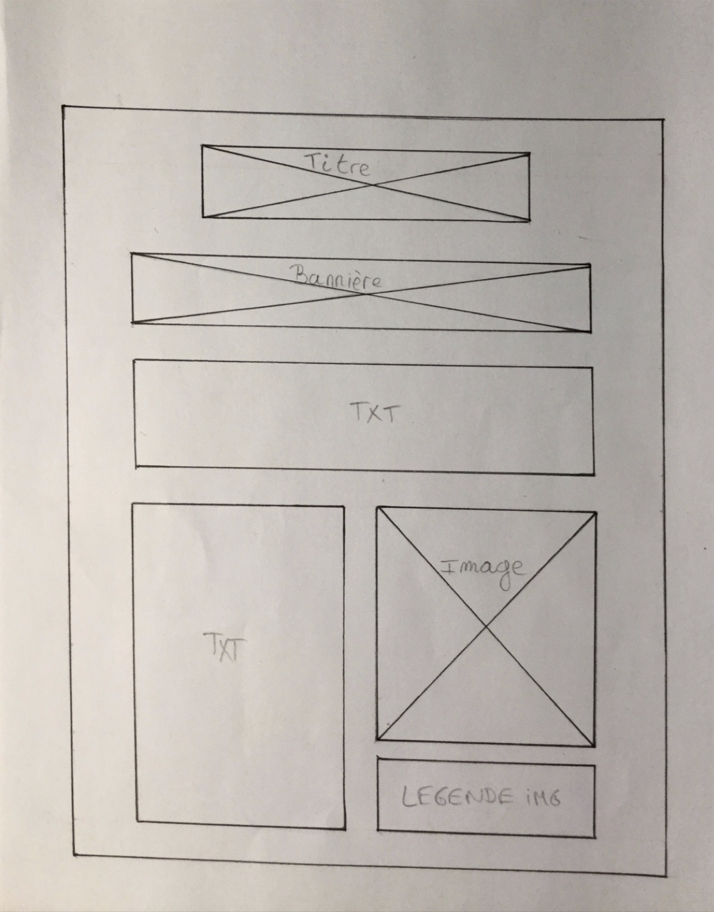
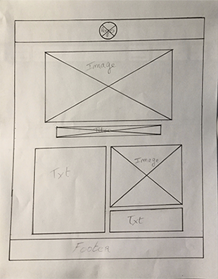

- Started to code the TributePage (HTML5 and CSS3)

**Aprox Time:** ***3 hours***

## Day 01: 29 April 2018

### Hello World!  

- Reviewed HTML5, CSS3, Bootstrap3 and JQuery courses already done in the past on FreeCodeCamp.

- Continued The Web Developer BootCamp by Colt Steele doing the Javascript courses (Introduction to JavaScript, Javascript Basics: Control Flow, Javascript Basics: Functions, Javascript Basics: Array and Javascript Basics: Objects)

**Aprox Time:** ***3 hours***