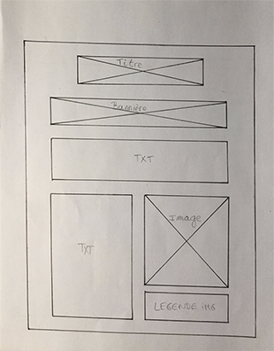

# 100 Days of Code Challenge

## Day 03: 01 May 2018

## Day 02: 30 April 2018

- Learned the basics of wireframes  

- Done 2 differents wireframes for the TributePage (*freeCodeCamp*)

- Started to code the TributePage (HTML5 and CSS3)

**Aprox Time:** ***3 hours***

## Day 01: 29 April 2018

### Hello World!  

- Reviewed HTML5, CSS3, Bootstrap3 and JQuery courses already done in the past on FreeCodeCamp.

- Continued The Web Developer BootCamp by Colt Steele doing the Javascript courses (Introduction to JavaScript, Javascript Basics: Control Flow, Javascript Basics: Functions, Javascript Basics: Array and Javascript Basics: Objects)

**Aprox Time:** ***3 hours***