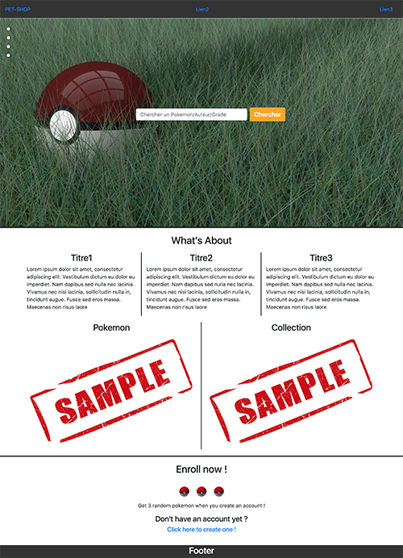
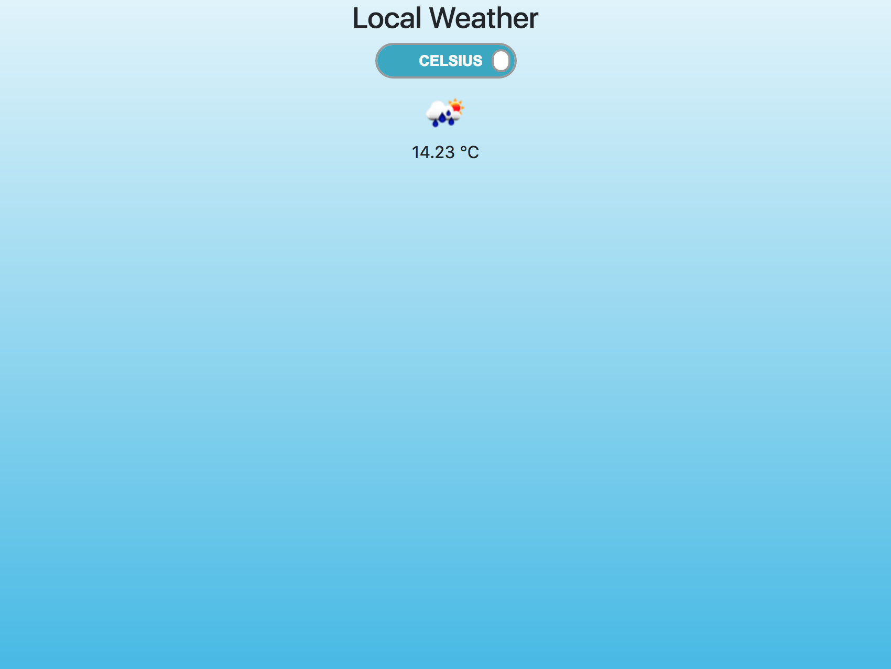

# 100 Days of Code Challenge

## Day 82 & 83: 20 & 21 July 2018

- Added new folders, started exercise about nodeJS/ExpressJS framework (npm, route and layout)  started to rewatch some section of the **MERN Stack Front To Back: Full Stak React, Redux & Node.js** (BRAD TRAVERSY).

**Aprox Time:** ***2.5 hours***

## Day 81: 19 July 2018

- Done new specification notes and started to think how to do the Pet Shop project.

**Aprox Time:** ***1 hour***

## Day 80: 18 July 2018

- Continued **The Advanced Web Developer Bootcamp** (COLT STEELE) Udemy courses. Done Introduction To React and JSX.

**Aprox Time:** ***1 hour***

## Day 76 to 79: 14 July to 17 July 2018

- Read NodeJS, ExpressJS and MongoDB documentation.

- Started to learn React language.

- Read HTTP and TCP documentation.

**Aprox Time:** ***5 hours***

## Day 75: 13 July 2018

- Continued my GitHub.io page. Added tab logo and title page, started the challenge page (sidenav menu, day section), added new logo and style.

**Aprox Time:** ***3 hours***

## Day 74: 12 July 2018

- Continued my GitHub.io page. Added functions to fade differents page section, added new logo, skills page section, completed portfolio section and added style.

**Aprox Time:** ***3 hours***

## Day 72 & 73: 10 & 11 July 2018

- Continued my GitHub.io page. Added new background and color, added text, logo, table, animated transition color on hover and removed animated arrow.

**Aprox Time:** ***2.5 hours***

## Day 71: 09 July 2018

- Continued my GitHub.io page. Added form to contact me, media logo, profile pic, centered and align elements, added style and smooth scroll animation when clicking the sidenav menu.

**Aprox Time:** ***1 hour***

## Day 70: 08 July 2018

- Continued my Pet Shop site. Added new route to modify user information and added form to modify them.

**Aprox Time:** ***1 hour***

## Day 69: 07 July 2018

- Read some NodeJS and ExpressJS documentation

- Searched solution to link node routes with anchor links (html)

**Aprox Time:** ***1 hour***

## Day 68: 06 July 2018

- Continued my Pet Shop site. Added new route to create an account and added template containing the form to sign in.
And desperately searched information about linking an url from anchor to nodeJS route.

**Aprox Time:** ***1 hour***

## Day 67: 05 July 2018

- Continued my Pet Shop site. Added text, link, max-width media query to remove an element when user use a phone and added sample image.

The phone version :    

**Aprox Time:** ***1 hour***

## Day 66: 04 July 2018

- Continued my Pet Shop site. Added a sidebar menu with animated scroll, text and gif, web page tab icon, and style.

**Aprox Time:** ***2 hours***

## MISSED 03 July 2018

## Day 65: 02 July 2018

- Continued my Pet Shop site. Added new background image, added home page route, added searchbar and style.

**Aprox Time:** ***1 hour***

## Day 64: 01 July 2018

- Continued **The Web Developer Bootcamp** (COLT STEELE) Udemy courses. Done the Authentication section.

**Aprox Time:** ***1 hour***

## Day 63: 30 June 2018

- Continued my Pet Shop site. Started a bit of the Front-End, added 2 new layouts and added basic structure for the home page.

**Aprox Time:** ***1 hour***

## Day 62: 29 June 2018

- Looked some of the best WebSite Design.

- Create a schema for my Pokemon Pet Shop site.

- Done the specifications for the P.P.S. project.

**Aprox Time:** ***1 hour***

## Day 61: 28 June 2018

Decided to transform my Pet Shop project to Pokemon Pet Shop, we can trade one or many pokemon to someone else the purpose will be to collect all the pokemon (1rst generation).

- Continued my Pet Shop site. Added Pokemon and collection models and collection route.

**Aprox Time:** ***1 hour***

## Day 60: 27 June 2018

- Continued my Pet Shop site. Added Profile model, profile routes (get, delete, post,...). Added Post get and delete routes.

**Aprox Time:** ***2 hours***

## Day 59: 26 June 2018

- Continued my Pet Shop site. Added Post route for posted form, added text validation and post model for mongoDB.

**Aprox Time:** ***1 hour***

## Day 58: 25 June 2018

- Looked some website design to get inspired with my GitHub.io  page and done some schemes.

**Aprox Time:** ***1 hour***

## Day 57: 24 June 2018

- Read some Node.JS and ExpressJS documentation.

**Aprox Time:** ***1 hour***

## Day 56: 23 June 2018

- Continued **The Web Developer Bootcamp** (COLT STEELE) Udemy courses. Done the Git and GitHub section.

**Aprox Time:** ***1 hour***

## Day 55: 22 June 2018

- Read documentation on arrow functions, difference between let, var and const declarations and read passport documentation.

**Aprox Time:** ***1 hour***

## Day 54: 21 June 2018

- Rewatched some sections of the **MERN Stack Front To Back: Full Stak React, Redux & Node.js** (BRAD TRAVERSY) Udemy course. 

- Continued my Pet Shop site. Added validators, new routes, login and register and authentification tokens.

**Aprox Time:** ***3 hours***

## Day 53: 20 June 2018

Finally decided to make an entirely new Pet Shop site (FullStack) and let the rewrite code for later.

- Continued **MERN Stack Front To Back: Full Stak React, Redux & Node.js** (BRAD TRAVERSY). Done the Profile API Routes section, the User API Routes & JWT Authentication.

- Started a fresh new Pet Shop site. Added dependencies and done basics routes.

- Continued [my GitHub.io page](https://scylidose.github.io/). Added animated anchors and div, added navbar, sections, text and arrow-links.

**Aprox Time:** ***3 hours***

## Day 52: 19 June 2018

- Continued **MERN Stack Front To Back: Full Stak React, Redux & Node.js** (BRAD TRAVERSY). Started the Profile API Routes section.

**Aprox Time:** ***1 hour***

## Day 51: 18 June 2018

- Continued **MERN Stack Front To Back: Full Stak React, Redux & Node.js** (BRAD TRAVERSY). Done the Post API Routes section.

**Aprox Time:** ***1 hour***

## Day 50: 17 June 2018

- Continued the Pet Shop project. Added new verification for the posted arguments, corrected some bugs, added new links, added new routes and can now ask to create an account.

**Aprox Time:** ***1 hour***

## Day 49: 16 June 2018

- Started **MERN Stack Front To Back: Full Stak React, Redux & Node.js** (BRAD TRAVERSY). Done the Introduction and Basic Express Setup sections.

**Aprox Time:** ***1 hour***

## Day 48: 15 June 2018

- Continued the Pet Shop project. Added post route and get posted arguments.

- Continued **The Web Developer Bootcamp** (COLT STEELE) Udemy courses. Done the Databases (MongoDB, Mongoose) section.

**Aprox Time:** ***2 hours***

## Day 47: 14 June 2018

- Started [my GitHub.io page](https://scylidose.github.io/).

- Decided to rewrite an old Flask/Jinja2/SQLite project to an node.JS/ExpressJS/MongoDB application.

Home Page now : 

How It'll look like : 

- Continued **The Web Developer Bootcamp** (COLT STEELE) Udemy courses. Done the Intermediate Express section.

**Aprox Time:** ***4 hours***

## Day 46: 13 June 2018

- Read documentation about Express JS.

**Aprox Time:** ***1 hour***

## Day 45: 12 June 2018

- Continued **The Web Developer Bootcamp** (COLT STEELE) Udemy courses. Done Server Side Frameworks.

**Aprox Time:** ***1 hour***

## Day 44: 11 June 2018

- Read documentation about NodeJS.

- Compared some backend language and decided to learn VueJS, AngularJS, Ruby, React and Redux for the next weeks.

**Aprox Time:** ***1 hour***

## Day 43: 10 June 2018

- Continued **The Web Developer Bootcamp** (COLT STEELE) Udemy courses. Done Node JS.

**Aprox Time:** ***1 hour***

## Day 42: 09 June 2018

- Continued **The Web Developer Bootcamp** (COLT STEELE) Udemy courses. Done The Command Line.

**Aprox Time:** ***1 hour***

## Day 41: 08 June 2018

- Continued **The Web Developer Bootcamp** (COLT STEELE) Udemy courses. Done the Backend Basics.

**Aprox Time:** ***1 hour***

## Day 40: 07 June 2018

- Finally got my Front-End certification o.o 

- Finished the Simon Game (*freeCodeCamp*). Corrected some remaining bugs.

**Aprox Time:** ***1 hour***

## Day 39: 06 June 2018

- Continued the Simon Game (*freeCodeCamp*). Added delay between generated colors, added win and error announcer, added score count and style.

**Aprox Time:** ***2 hours***

## Day 38: 05 June 2018

- Read chapters from the **JAVASCRIPT & JQUERY** *interactive front-end web development* (JON DUCKETT) book.

- Learn how CSS grid and Flexbox works.

**Aprox Time:** ***1 hour***

## Day 37: 04 June 2018

- Continued the Simon Game (*freeCodeCamp*). Tried again to add delay when iterating, verify if what we click correspond to what generated and added loose function, added outline none to quadra colors.

**Aprox Time:** ***1 hour***

## Day 36: 03 June 2018

- Read articles about CSS tricks 

- Read a bit of the **JAVASCRIPT & JQUERY** *interactive front-end web development* (JON DUCKETT) book.

**Aprox Time:** ***1 hour***

## Day 35: 02 June 2018

- Continued the Simon Game (*freeCodeCamp*). Added strict button and done lot of research to add delay in for loops.

- Read two chapters from the **JAVASCRIPT & JQUERY** *interactive front-end web development* (JON DUCKETT) book.

**Aprox Time:** ***1.5 hour***

## Day 34: 01 June 2018

- Started the Simon Game (*freeCodeCamp*). Added background color, added style for the buttons, and script to change color when a color is picked.

**Aprox Time:** ***2 hours***

## Day 33: 31 May 2018

- Completed Basic HTML and HTML5, Basic CSS and Responsive Web Design Principles sections (*freeCodeCamp*).

- Finished the Tic Tac Toe Game (*freeCodeCamp*). Added background color, added style for the restart buttons, style for the text for restart and win announce, added very basic IA player, can choose to play against a player or a machine.

- Adapted all my README so it correspond to the new site of freeCodeCamp.

**Aprox Time:** ***4 hours***

## Day 32: 30 May 2018

- Continued the Tic Tac Toe Game (*freeCodeCamp*). Added restart, end game, announce the player that win, added fadeIn transition, added new background color (win, lose, neutral, player1, player2), and refactored code.

**Aprox Time:** ***2 hours***

## Day 31: 29 May 2018

- Started the Tic Tac Toe Game (*freeCodeCamp*). Added basic style to represent Tic Tac Toe game and change text in button depending the player that plays.

**Aprox Time:** ***1 hour***

## Day 30: 28 May 2018

- Finished the Pomodoro Clock (*freeCodeCamp*). Added style, added icons for start, stop and reset button, added animation and switch play/stop button when clicking.

- Finished to read the **HTML & CSS** *design and build websites* (JON DUCKETT) book.

**Aprox Time:** ***4 hours***

## Day 29: 27 May 2018

- Started the Pomodoro Clock (*freeCodeCamp*). Can set minutes and seconds, start, stop and reset the timer and can show the time.

- Read informations about the Pomodoro technique.

- Finished the JavaScript Calculator (*freeCodeCamp*). Added percentage, square, decimal and basics arithmetics operations. Disabled Memory related buttons.

**Aprox Time:** ***4 hours***

## Day 28: 26 May 2018

- Started the JavaScript Calculator (*freeCodeCamp*). Added div, buttons, input and text for the calculator, added style for the body and the calculator and added click events (numbers, reset, ON/OFF) and added an indicator that show if the calculator is ON or not.

I decided to replicate one of my calculator found recently on my desk 😆

There it is : 

**Aprox Time:** ***2 hours***

## Day 27: 25 May 2018

- Finished the Intermediate Algorithm Scripting (*freeCodeCamp*).

**Aprox Time:** ***1 hour***

## Day 26: 24 May 2018

- Done few algorithms from the Intermediate Algorithm Scripting (*freeCodeCamp*).

- Corrected some issue in previous freeCodeCamp projects, created pen for each project and submited it.

**Aprox Time:** ***2 hours***

## Day 25: 23 May 2018

- Done few algorithms from the Intermediate Algorithm Scripting (*freeCodeCamp*).

- Done the Patatap Clone project (*The Web Developer Bootcamp*).

**Aprox Time:** ***2 hours***

## Day 24: 22 May 2018

- Finished the TODO List project (*The Web Developer Bootcamp*). Added icons, fade transition, added important button and show date.

My solution :

Colt Steele solution : 

**Aprox Time:** ***3 hours***

## Day 23: 21 May 2018

- Started the TODO List project (*The Web Developer Bootcamp*). Can add, delete and mark as finished To-Do elements.

- Done Intro to jQuery and Advanced jQuery (*The Web Developer Bootcamp*).

- Finished the Color Game project (*The Web Developer Bootcamp*). Added score and attempts mechanics, can now switch between modes, added style and refactored some code.

My solution :

Colt Steele solution : 

**Aprox Time:** ***4 hours***

## Day 22: 20 May 2018

- Started the Color Game project (*The Web Developer Bootcamp*). Added random color generator, show RGB code to find, can play it (win or lose) and start new game after a win.

**Aprox Time:** ***2 hours***

## Day 21: 19 May 2018

- Continue the courses from The Web Developer Bootcamp, watched the Color Game project directives.

- Read some chapters about CSS grid from the book : **HTML & CSS** *design and build websites* (JON DUCKETT)

**Aprox Time:** ***1 hour***

## Day 20: 18 May 2018

Time to move on from freeCodeCamp projects for a while :D  

- Done the *DOM Manipulation* and the *Advanced DOM Manipulation* from The Web Developer Bootcamp.

**Aprox Time:** ***1.5 hour***

## Day 19: 17 May 2018

- Finished the Twitch.tv JSON API project (*freeCodeCamp*). Added the ability to search if someone is living, now can show author that are not living and added new fadeIn transition.

- I reorganized my gitHub repositories (deleted some repositories and added new ones with old projects).

**Aprox Time:** ***2 hours***

## Day 18: 16 May 2018

- Started the Twitch.tv JSON API project (*freeCodeCamp*). Added twitch logo, search bar (from the wikipedia project), added box containing author, title, preview and link for channels in a list.

**Aprox Time:** ***1.5 hour***

## Day 17: 15 May 2018

- Read documentation about JSONP method.

- Finished the Wikipedia Viewer project (*freeCodeCamp*). Added Ajax request, animation and style for results.

**Aprox Time:** ***2.5 hours***

## Day 16: 14 May 2018

- Started the Wikipedia Viewer project (*freeCodeCamp*). Added wikipedia logo, search bar and button. Animated placeholder and fadeIn when page is ready.

**Aprox Time:** ***2 hours***

## Day 15: 13 May 2018

- Finished the Local Weather generator(*freeCodeCamp*). Can now show flag country, city, wind speed with estimation given by [Beaufort scale](https://en.wikipedia.org/wiki/Beaufort_scale) 

**Aprox Time:** ***1 hour***

## Day 14: 12 May 2018

- Started the Local Weather generator (*freeCodeCamp*). Added bootstrap, added toggle button (HTML5, CSS3) from proto.io, added geolocalisation, show celsius or fahranheit and local weather (Javascript, JQuery).

**Aprox Time:** ***1.5 hour***

## Day 13: 11 May 2018

- Read about DOM Tree from the **JAVASCRIPT & JQUERY** *interactive front-end web development* (JON DUCKETT).

- Drawn a DOM Tree related to the Random Quote Machine (*freeCodeCamp*).

- Finished the Random Quote Machine (*freeCodeCamp*). Added new style.

  

**Aprox Time:** ***2 hours***

## Day 12: 10 May 2018

- Read about JQuery functions from the **JAVASCRIPT & JQUERY** *interactive front-end web development* (JON DUCKETT).

- Continue the Random Quote Machine (*freeCodeCamp*). Added a button that can tweet the actual quote, avoid div resize, added new margin, padding and radius and added fade transition between quotes.

  

**Aprox Time:** ***2.5 hours***

## Day 11: 09 May 2018

- Started the Random Quote Machine (HTML, JavaScript and JQuery), defined list of quotes, create function that retrieved a random quote with an image of the author.

  

**Aprox Time:** ***1.5 hour***

## Day 10: 08 May 2018

- Read few articles about web development jobs, tricks and front-end cheatsheets.  

**Aprox Time:** ***1 hour***

## Day 09: 07 May 2018

- Read articles about CSS selectors.  

- Read articles about tricks in CSS. (https://css-tricks.com/).  

**Aprox Time:** ***1 hour***

## Day 08: 06 May 2018

- Completed JSON APIs and Ajax (*freeCodeCamp*)

- Continued the *The Advanced Web Developer Bootcamp* course

**Aprox Time:** ***1 hour***

## Day 07: 05 May 2018

- Completed Basic Algorithm Scripting (*freeCodeCamp*)

**Aprox Time:** ***1.5 hour***  

## Day 06: 04 May 2018

- Completed Basic JavaScript (*freeCodeCamp*)  

- Completed Object Oriented and Functional Programming (*freeCodeCamp*)  

**Aprox Time:** ***2 hours***  

## Day 05: 03 May 2018

- Done coding the Portfolio page for the *freeCodeCamp* (HTML5, CSS3, Bootstrap4, JavaScript, JQuery).

  

  

**Aprox Time:** ***2.5 hours***

## Day 04: 02 May 2018

- Finished to code the TributePage (HTML5, CSS3, Bootstrap 4).

Computer :  
  
Tablet :  
  
Phone :   
  

**Aprox Time:** ***1 hour***

## Day 03: 01 May 2018

- Read how to use CSS grid.

- Continued to code the TributePage, centering and align text and images.

**Aprox Time:** ***1.5 hour***

## Day 02: 30 April 2018

- Learned the basics of wireframes  

- Done 2 differents wireframes for the TributePage (*freeCodeCamp*)  

- Started to code the TributePage (HTML5 and CSS3)

**Aprox Time:** ***3 hours***

## Day 01: 29 April 2018

### Hello World!  

- Reviewed HTML5, CSS3, Bootstrap3 and JQuery courses already done in the past on FreeCodeCamp.

- Continued The Web Developer BootCamp by Colt Steele doing the Javascript courses (Introduction to JavaScript, Javascript Basics: Control Flow, Javascript Basics: Functions, Javascript Basics: Array and Javascript Basics: Objects)

**Aprox Time:** ***3 hours***