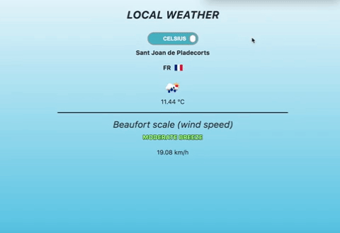

# 100 Days of Code Challenge

# freeCodeCamp : Learn to Code and Help Nonprofits

My solutions to the projects offered by [freeCodeCamp](https://www.freecodecamp.org)

# Projects

## Responsive Web Design

### Responsive Web Design Projects

* [Build a Tribute Page](https://github.com/Scylidose/100DaysOfCodeChallenge/tree/master/FreeCodeCamp/Responsive%20Web%20Design/Tribute%20Page)  

  

* Build a Survey Form

* Build a Product Landing Page

* Build a Technical Documentation Page

* [Build a Personal Portfolio Webpage](https://github.com/Scylidose/100DaysOfCodeChallenge/tree/master/FreeCodeCamp/Responsive%20Web%20Design/Portfolio)  

  

## Front End Libraries

### Front End Libraries Projects

* [Build a Random Quote Machine](https://github.com/Scylidose/100DaysOfCodeChallenge/tree/master/FreeCodeCamp/Front%20End%20Libraries/Random%20Quote%20Machine)

* Build a Markdown Previewer

* Build a Drum Machine

* [Build a Javascript Calculator](https://github.com/Scylidose/100DaysOfCodeChallenge/tree/master/FreeCodeCamp/Front%20End%20Libraries/JavaScript%20Calculator)

* [Build a Pomodoro Clock](https://github.com/Scylidose/100DaysOfCodeChallenge/tree/master/FreeCodeCamp/Front%20End%20Libraries/Pomodoro%20Clock)

## Coding Interview Prep

### Take Home Projects

* [Show the Local Weather](https://github.com/Scylidose/100DaysOfCodeChallenge/tree/master/FreeCodeCamp/Coding%20Interview%20Prep/Local%20Weather)

* [Build a Wikipedia Viewer](https://github.com/Scylidose/100DaysOfCodeChallenge/tree/master/FreeCodeCamp/Coding%20Interview%20Prep/Wikipedia%20Viewer)

* [Use the Twitch.tv JSON API](https://github.com/Scylidose/100DaysOfCodeChallenge/tree/master/FreeCodeCamp/Coding%20Interview%20Prep/Twitch.tv%20JSON%20API)

*[Build a Tic Tac Toe Game](https://github.com/Scylidose/100DaysOfCodeChallenge/tree/master/FreeCodeCamp/Coding%20Interview%20Prep/Tic%20Tac%20Toe%20Game)

