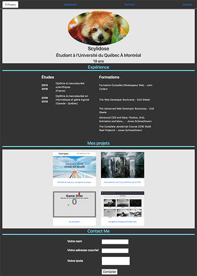

# 100 Days of Code Challenge

# freeCodeCamp : Learn to Code and Help Nonprofits

My solutions to the projects offered by [freeCodeCamp](https://www.freecodecamp.org)

# Projects

## Front End Development

### Basic Front End Development Projects

* [Build a Tribute Page](https://github.com/Scylidose/100DaysOfCodeChallenge/tree/master/FreeCodeCamp/Tribute%20Page)  

  

* [Build a Personal Portfolio Webpage](https://github.com/Scylidose/100DaysOfCodeChallenge/tree/master/FreeCodeCamp/Portfolio)  

  

### Intermediate Front End Development Projects

* [Build a Random Quote Machine](https://github.com/Scylidose/100DaysOfCodeChallenge/tree/master/FreeCodeCamp/Random%20Quote%20Machine)

* [Show the Local Weather](https://github.com/Scylidose/)

* Build a Wikipedia Viewer

* Use the Twitch.tv JSON API

### Advanced Front End Development Projects

* Build a Javascript Calculator

* Build a Pomodoro Clock

* Build a Tic Tac Toe Game

* Build a Simon Game
