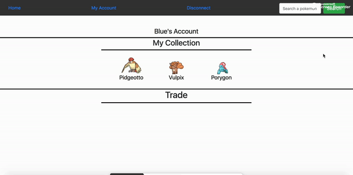
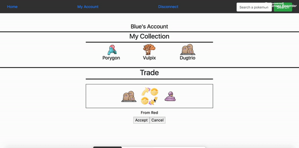
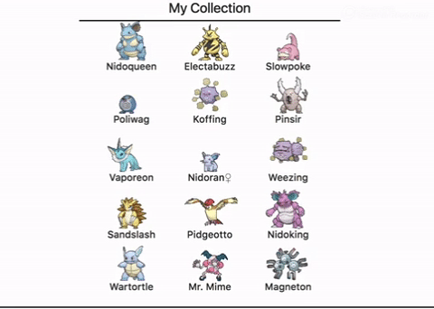

# 100 Days of Code Challenge

# Training

Repository where I'll post all of non-related online courses projects.

## Projects

### Pokemon Pet Shop (Full Stack)  

Become a Pokemon Trainer, receive your 3 first Pokemons and try to collect them'all by trading differents Pokemon with other Trainer.

Register and Log In  

Search and ask for a **Trade**  

Accept the **Trade**  

Get the best **Collection**  

- Programmed with :
    - Front-End : *Pug (Jade), CSS3, Bootstrap4, JavaScript, JQuery*
    - Back-End : *NodeJS, ExpressJS, MongoDB*

- Next things to do : 
    - Create differents grades to show the experimented Trainers.
    - Can search Pokemon with an associated user grade.
    - Add style to form and buttons
    - Get coins for every trade
    - Can get a random Pokemon with the earned coins
